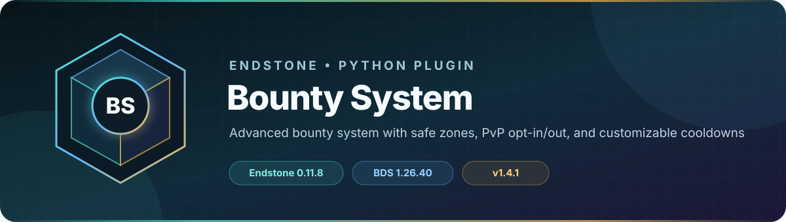

<!-- endstone-professional-header:start -->
<p align="center">
  
</p>

<p align="center">
  <a href="https://github.com/TheNINJALLO/endstone-bounty-system/actions/workflows/wheel-release.yml"></a>
  <a href="https://github.com/TheNINJALLO/endstone-bounty-system/releases/latest"></a>
</p>

<p align="center">
  
  
  
  =3.10" src="https://img.shields.io/badge/Python-%3E=3.10-3776AB?style=flat-square&amp;logo=python&amp;logoColor=white">
</p>

<p align="center">
  <strong>Advanced bounty system with safe zones, PvP opt-in/out, and customizable cooldowns.</strong>
</p>

<p align="center">
  <a href="#overview">Overview</a> &bull;
  <a href="#compatibility">Compatibility</a> &bull;
  <a href="#install">Install</a> &bull;
  <a href="https://github.com/TheNINJALLO/endstone-bounty-system/releases">Releases</a>
</p>

## Overview

Advanced bounty system with safe zones, PvP opt-in/out, and customizable cooldowns. This release is aligned with Endstone 0.11.8 and Minecraft Bedrock Dedicated Server 1.26.40, and is distributed as a Python wheel for direct installation in an Endstone server.

## Capabilities

-

## Compatibility

| Component | Supported version |
|---|---|
| Endstone | `0.11.8` |
| Endstone API | `0.11` |
| Bedrock Dedicated Server | `1.26.40` |
| Python | `>=3.10` |
| Plugin release | `v1.4.2` |

## Install

Download the wheel from the matching GitHub release:

```bash
gh release download v1.4.2 --repo TheNINJALLO/endstone-bounty-system --pattern "*.whl"
```

Copy the downloaded wheel into the server's `plugins/` directory, remove any older wheel for the same plugin, and restart Endstone.

> [!IMPORTANT]
> Use Endstone `0.11.8` with BDS `1.26.40`. Back up worlds and plugin data before upgrading a production server.

## Configuration and secrets

Runtime databases, logs, local `.env` files, server directories, and root `config.toml` files are excluded from source releases. When an example configuration is provided, copy it locally and keep live tokens, passwords, webhook URLs, and server identifiers out of Git.

## Release automation

Every `v*` tag runs [the wheel release workflow](.github/workflows/wheel-release.yml), builds the package in a clean GitHub runner, stores the wheel as a workflow artifact, and attaches it to the matching GitHub release.
<!-- endstone-professional-header:end -->

---

## Project guide

A comprehensive bounty system plugin for Minecraft Bedrock Edition servers using Endstone. Place bounties on players, manage safe zones, and control PvP with opt-in/opt-out mechanics.

## Features

### Core Bounty System
- **Place Bounties**: Players can place bounties on other players using the vanilla "Money" scoreboard objective
- **Stackable Bounties**: Multiple players can add to the same bounty, increasing the reward
- **Leaderboard**: View all active bounties sorted by total amount
- **Automatic Claiming**: Bounties are automatically claimed when the target is killed by another player
- **User-Friendly Forms**: All interactions use intuitive in-game forms (no complex command syntax required)
- **PvP Altar Item**: Use a custom `ninjos:pvp_altar` item to access the bounty menu anywhere

### Safe Zones
- **No PvP Zones**: Areas where players cannot be killed at all
- **PvP Zones (No Bounties)**: Areas where PvP is allowed for ALL players (including opted-out players) but bounties cannot be claimed - perfect for arenas
- **Multi-Dimensional**: Safe zones are dimension-specific (Overworld, Nether, End)

### Two-Tier Opt-In System (PvP + Bounty)
- **Separate PvP and Bounty Opt-In**: Players must first opt into PvP, then separately opt into Bounties
- **PvP Opt-In**: Controls whether a player can attack/be attacked by other players
- **Bounty Opt-In**: Controls whether a player can place/claim/have bounties placed on them (requires PvP to be enabled first)
- **Free First Opt-In**: The first time opting into PvP AND Bounties is FREE with no cooldown!
- **Cooldowns**: Customizable cooldowns for toggling both PvP and Bounty status (default: 1 day to opt-in, 3 days to opt-out)
- **Cooldown Waiving**: Pay to bypass opt-in/opt-out cooldowns immediately for either PvP or Bounty
- **Automatic Bounty Disable**: When opting out of PvP, Bounty participation is automatically disabled
- **Force PvP Mode**: Optional server-wide setting that allows all players to attack each other while maintaining bounty restrictions for bounty-opted-in players only

### Protection Periods
- **New Player Protection**: New players have a configurable protection period before they can be attacked (default: 3 days)
- **Post-Bounty Protection**: After a bounty is claimed, players get a protection period before they can be attacked again (default: 3 days)
- **Waivable Protections**: Players can pay to remove their protections early if they want to participate sooner
- **Comprehensive Protection**: All protections apply to direct attacks, projectiles (arrows), and fire damage (fire aspect weapons)
- **PvP Zone Override**: Protections are bypassed inside PvP zones (arenas)

## Installation

1. Install Endstone on your Minecraft Bedrock Dedicated Server
2. Copy the plugin to your `plugins` directory:
   ```bash
   pip install endstone-bounty-system
   ```
3. Ensure you have a scoreboard objective named "Money" created:
   ```
   /scoreboard objectives add Money dummy "Money"
   ```
4. Restart your server

## Commands

### Player Commands

#### `/bounty`
Opens the bounty placement form where you can:
- Select a target player from the dropdown (only shows players with Bounties enabled)
- Enter the bounty amount
- Confirm the bounty placement

**Requirements**: You must have both PvP AND Bounties enabled to place bounties.

**Permission**: `bounty.use` (default: everyone)

#### `/bounty list`
Displays the bounty leaderboard showing:
- All active bounties
- Total bounty amounts
- List of contributors and their individual contributions

**Permission**: `bounty.use` (default: everyone)

#### `/bounty opt`
Toggle your PvP opt-in/opt-out status.
- Shows your current PvP status
- Displays remaining cooldown time if applicable
- Subject to cooldowns (1 day to opt-in, 3 days to opt-out by default)
- When opting out of PvP, Bounty participation is automatically disabled

**Permission**: `bounty.use` (default: everyone)

#### `/bounty bopt`
Toggle your Bounty opt-in/opt-out status.
- **Requires PvP to be enabled first**
- Shows your current Bounty status
- Displays remaining cooldown time if applicable
- Subject to cooldowns (1 day to opt-in, 3 days to opt-out by default)

**Permission**: `bounty.use` (default: everyone)

#### `/bounty waive`
Opens a form to waive protection periods and cooldowns early by paying a fee:
- **Waive New Player Protection**: Pay to remove new player protection early (default: 1000 coins)
- **Waive Post-Bounty Protection**: Pay to remove post-bounty protection early (default: 500 coins)
- **Waive PvP Opt-In Cooldown**: Pay to enable PvP immediately without waiting (default: 1000 coins)
- **Waive PvP Opt-Out Cooldown**: Pay to disable PvP immediately without waiting (default: 500 coins)
- **Waive Bounty Opt-In Cooldown**: Pay to enable Bounties immediately without waiting (default: 1000 coins)
- **Waive Bounty Opt-Out Cooldown**: Pay to disable Bounties immediately without waiting (default: 500 coins)

**Permission**: `bounty.use` (default: everyone)

### Admin Commands (Operator Only)

#### `/bounty config`
Opens the server configuration form (two pages) to adjust plugin settings:

**Page 1 - General Settings:**
- **New Player Protection**: Duration in days (default: 3 days)
- **Post-Bounty Protection**: Duration in days (default: 3 days)
- **PvP Opt-In Cooldown**: Duration in days (default: 1 day)
- **PvP Opt-Out Cooldown**: Duration in days (default: 3 days)
- **Bounty Opt-In Cooldown**: Duration in days (default: 1 day)
- **Bounty Opt-Out Cooldown**: Duration in days (default: 3 days)
- **Minimum Bounty Amount**: Minimum bounty that can be placed (default: 100 coins)
- **Force PvP Enabled**: Toggle Force PvP mode on/off

**Page 2 - Waiver Costs:**
- **New Player Waiver Cost**: Cost to waive new player protection (default: 1000 coins)
- **Death Protection Waiver Cost**: Cost to waive post-bounty protection (default: 500 coins)
- **PvP Opt-In Waiver Cost**: Cost to waive PvP opt-in cooldown (default: 1000 coins)
- **PvP Opt-Out Waiver Cost**: Cost to waive PvP opt-out cooldown (default: 500 coins)
- **Bounty Opt-In Waiver Cost**: Cost to waive Bounty opt-in cooldown (default: 1000 coins)
- **Bounty Opt-Out Waiver Cost**: Cost to waive Bounty opt-out cooldown (default: 500 coins)

All settings are saved to `config.json` and persist across server restarts.

**Permission**: `bounty.admin` (default: op)

#### `/safezone`
Opens the Safe Zone Management menu with the following options:

**Permission**: `bounty.admin` (default: op)

##### Create New Zone
Opens a form to create a new safe zone:
- **Zone Name**: Unique identifier for the zone (e.g., spawn, arena, shop)
- **Corner 1 Coordinates**: X, Y, Z coordinates for the first corner
- **Corner 2 Coordinates**: X, Y, Z coordinates for the opposite corner
- **Zone Type**: Choose between:
  - `No PvP`: Players cannot be killed in this zone at all
  - `PvP Allowed (No Bounties)`: PvP is allowed for ALL players (even opted-out players), but bounties cannot be claimed. This is ideal for arenas where everyone can fight.

The form automatically shows your current position for convenience when setting coordinates.

##### Remove Zone
Opens a dropdown menu to select and remove an existing safe zone.

##### List All Zones
Displays all configured safe zones with their:
- Name
- Coordinates (both corners)
- Zone type (No PvP or PvP Allowed)
- Dimension

## Configuration

The plugin creates a `config.json` file in the `plugins/endstone_bounty_system` directory with the following customizable settings:

```json
{
    "pvp_opt_in_cooldown": 86400,
    "pvp_opt_out_cooldown": 259200,
    "bounty_opt_in_cooldown": 86400,
    "bounty_opt_out_cooldown": 259200,
    "new_player_protection": 259200,
    "post_bounty_protection": 259200,
    "new_player_waiver_cost": 1000,
    "death_protection_waiver_cost": 500,
    "opt_in_waiver_cost": 1000,
    "opt_out_waiver_cost": 500,
    "bounty_opt_in_waiver_cost": 1000,
    "bounty_opt_out_waiver_cost": 500,
    "min_bounty_amount": 100,
    "money_objective": "Money",
    "force_pvp_enabled": false
}
```

### Configuration Options

| Option | Default | Description |
|--------|---------|-------------|
| `pvp_opt_in_cooldown` | 86400 | Cooldown in seconds for enabling PvP (1 day) |
| `pvp_opt_out_cooldown` | 259200 | Cooldown in seconds for disabling PvP (3 days) |
| `bounty_opt_in_cooldown` | 86400 | Cooldown in seconds for enabling Bounty participation (1 day) |
| `bounty_opt_out_cooldown` | 259200 | Cooldown in seconds for disabling Bounty participation (3 days) |
| `new_player_protection` | 259200 | Protection period for new players in seconds (3 days) |
| `post_bounty_protection` | 259200 | Protection period after bounty is claimed in seconds (3 days) |
| `new_player_waiver_cost` | 1000 | Cost to waive new player protection early |
| `death_protection_waiver_cost` | 500 | Cost to waive post-bounty protection early |
| `opt_in_waiver_cost` | 1000 | Cost to waive PvP opt-in cooldown early |
| `opt_out_waiver_cost` | 500 | Cost to waive PvP opt-out cooldown early |
| `bounty_opt_in_waiver_cost` | 1000 | Cost to waive Bounty opt-in cooldown early |
| `bounty_opt_out_waiver_cost` | 500 | Cost to waive Bounty opt-out cooldown early |
| `min_bounty_amount` | 100 | Minimum bounty amount that can be placed |
| `money_objective` | "Money" | Name of the scoreboard objective used for currency |
| `force_pvp_enabled` | false | If true, all players can attack each other (safe zones still apply), but only bounty-opted-in players can claim/have bounties |

## How It Works

### Placing a Bounty

1. **Enable PvP first**: You must have PvP enabled (`/bounty opt`)
2. **Enable Bounties**: You must also have Bounties enabled (`/bounty bopt`)
3. Use `/bounty` to open the bounty form
4. Select the target player from the dropdown (only shows players with Bounties enabled)
5. Enter the bounty amount (must have enough money in your scoreboard)
6. Confirm to place the bounty
7. The money is immediately deducted from your scoreboard
8. The target is notified of the bounty

**Note**: Only players with Bounties enabled can place bounties on other players with Bounties enabled.

### Claiming a Bounty

Bounties are automatically claimed when:
1. The bounty target is killed by another player
2. Both the killer and target have **Bounties enabled**
3. Neither player is in a safe zone (or in a bounty-restricted zone)
4. The target is not under new player or post-bounty protection

When claimed:
- The full bounty amount is added to the killer's scoreboard
- The bounty is removed from the target
- The target receives a 3-day (default) protection period
- A server-wide broadcast announces the bounty claim

### Safe Zones

Safe zones are rectangular areas defined by two opposite corners. They can be configured in two modes:

1. **No PvP** (`no_pvp`): Players cannot be killed at all in this zone
2. **PvP Zone (No Bounties)** (`pvp_no_bounty`): PvP is allowed for ALL players regardless of opt-in status, but bounty claims are prevented. This is ideal for arenas.

**PvP Zone Behavior:**
- All players can attack each other inside PvP zones, even if they have PvP disabled
- New player protection is bypassed inside PvP zones
- Post-bounty protection is bypassed inside PvP zones
- Bounties can never be claimed inside PvP zones
- Only one player needs to be in the PvP zone for these rules to apply

### Two-Tier Opt-In System

Players control their participation through a two-tier system:

#### Tier 1: PvP Opt-In (`/bounty opt`)
- New players start with PvP **disabled**
- **First PvP opt-in is FREE** with no cooldown!
- Controls whether you can attack/be attacked by other players
- When opting out of PvP, Bounty participation is automatically disabled
- Cooldowns prevent rapid toggling:
  - **Opt-in cooldown**: 1 day (default) - applies after first opt-in
  - **Opt-out cooldown**: 3 days (default)

#### Tier 2: Bounty Opt-In (`/bounty bopt`)
- **Requires PvP to be enabled first**
- **First Bounty opt-in is FREE** with no cooldown!
- Controls whether you can place/claim/have bounties placed on you
- Cooldowns prevent rapid toggling:
  - **Opt-in cooldown**: 1 day (default) - applies after first opt-in
  - **Opt-out cooldown**: 3 days (default)

#### Status Combinations
| PvP | Bounty | Result |
|-----|--------|--------|
| ❌ | ❌ | Protected from all PvP (except in PvP zones) |
| ✅ | ❌ | Can fight other PvP players, but no bounty participation |
| ✅ | ✅ | Full bounty hunting enabled |
| ❌ | ✅ | Not possible (Bounty requires PvP) |

### Force PvP Mode

When Force PvP mode is enabled by an administrator:
- **All players can attack each other**, regardless of PvP opt-in status
- **Safe zones are still respected** (no PvP in no-PvP zones)
- **New player and post-bounty protections are bypassed**
- **Only bounty-opted-in players can claim bounties** (non-opted-in players get nothing)
- **Only bounty-opted-in players can have bounties placed on them**
- This mode is useful for PvP events or servers that want open combat with optional bounty participation

### Protection Periods

#### New Player Protection
- Starts when a player first joins the server
- Default: 3 days (259,200 seconds)
- Protected players cannot be attacked by other players
- Players are notified of remaining protection time
- Can be waived early by paying a fee (`/bounty waive`)
- **Bypassed in PvP zones**

#### Post-Bounty Protection
- Starts immediately after a bounty is claimed on a player
- Default: 3 days (259,200 seconds)
- Protected players cannot be attacked by other players
- Prevents immediate re-bounty griefing
- Can be waived early by paying a fee (`/bounty waive`)
- **Bypassed in PvP zones**

#### Protection Against All Damage Types
The plugin protects players from all forms of player-caused damage:
- **Direct melee attacks** (swords, axes, etc.)
- **Projectiles** (arrows, tridents, etc.)
- **Fire damage** from fire aspect weapons
- Fire damage is tracked and attributed to the player who caused it (up to 5 seconds after the initial hit)

### PvP Altar Item

The plugin supports a custom item (`ninjos:pvp_altar`) that opens the bounty system menu when used:
- Right-click with the item to open the PvP Altar menu
- Menu shows your current PvP and Bounty status
- Available options:
  - **Place Bounty** (only if Bounty opted in)
  - **Waive Protection/Cooldown** - pay to remove protections/cooldowns
  - **Toggle PvP Opt In/Out** - change your PvP status
  - **Toggle Bounty Opt In/Out** - change your Bounty status (only if PvP enabled)
  - **View Leaderboard** - see all active bounties

## Data Storage

The plugin stores data in JSON files in the `plugins/endstone_bounty_system` directory:

- `config.json`: Configuration settings
- `bounty_data.json`: Active bounties, safe zones, and player data

All data is automatically saved when:
- The plugin is disabled/reloaded
- Changes are made to bounties or safe zones
- Player data is updated

## Permissions

| Permission | Default | Description |
|------------|---------|-------------|
| `bounty.use` | true | Allows using player bounty commands |
| `bounty.admin` | op | Allows managing safe zones |

## Technical Details

### Server-Side Scoreboard Operations

The plugin uses server-executed commands to manage the Money scoreboard, ensuring:
- All operations are performed as the console/server, not as the player
- Player-specific scoreboards are correctly accessed
- No permission issues with scoreboard modifications

Example internal commands:
```
scoreboard players add "PlayerName" Money 1000
scoreboard players remove "PlayerName" Money 500
```

### Event Handling

The plugin listens for:
- `PlayerJoinEvent`: Track new player join times and initialize player data
- `PlayerDeathEvent`: Handle bounty claims when players are killed
- `ActorDamageEvent`: Prevent unauthorized PvP damage (direct attacks, projectiles, and fire damage)
- `PlayerInteractEvent`: Handle PvP Altar item interactions
- `PlayerMoveEvent`: Optional zone entry/exit notifications

## Requirements

- Endstone 0.5+
- Python 3.9+
- Minecraft Bedrock Dedicated Server
- A scoreboard objective named "Money" (or configured name)

## Troubleshooting

### "Money objective not found" error
Create the scoreboard objective:
```
/scoreboard objectives add Money dummy "Money"
```

### Bounties not being claimed
Check that:
1. Both players have **Bounties enabled** (`/bounty bopt`)
2. Neither player is in a PvP zone (bounties cannot be claimed in PvP zones)
3. Neither player is in a No PvP safe zone
4. The target is not under protection (new player or post-bounty protection)
5. The killer actually delivered the final blow
6. If Force PvP mode is enabled, verify both players have Bounties opted-in to claim/have bounties

### Cannot place bounties
Check that:
1. You have PvP enabled (`/bounty opt`)
2. You have Bounties enabled (`/bounty bopt`)
3. The target player has Bounties enabled
4. You have enough money in your scoreboard
5. The target is not under post-bounty protection

### Safe zones not working
Verify:
1. Coordinates are correct (use F3 in-game)
2. The dimension name matches
3. The zone was created successfully (check `/safezone list`)

## Support & Issues

For bug reports, feature requests, or support, please contact the server administrator.

## License

Apache-2.0

## Credits

Created for Endstone Minecraft Bedrock servers.
